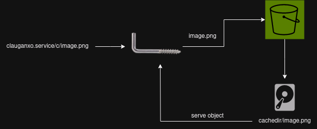

# clauganxo

### What does clauganxo mean?
*clauganxo* in Catalan, or *alcayata* in Spanish is what in English is called "hook??".  
Is the thingy that you put in the wall when you want to hang something, for example a picture.


### What is the main purpose of this service?

We have an application that relies on Amazon S3 as the image storage, once day we received a bill with high transfer costs coming from AWS, taking a look we saw that everything came from the images and all the calls that were done to S3 in order to serve them.
With this service we reduced the API calls and the transfer costs to S3, instead of making Amazon serve our images everytime, we're storing them locally and then serving them.  
This service is built with the intention to serve ONLY IMAGES.

__tldr__: we didn't want to pay high s3 costs and we've built a local cache with go

### How is this service working?

This service gets objects from the desired s3 bucket, it gets stored at the desired cache directory and then it's served.


You start the service with your custom configuration and then request your image at ```http://yourclauganxoservice.com/c/object.png```  
That's it!

All objects are served from /c path

### Configuration 

* ```directory``` -> Where your objects will be stored
* ```port``` = Port where the service will listen
* ```profile``` = AWS Profile to use
* ```bucket``` = S3 Bucket where objects are stored
* ```region``` = AWS Region to use
* ```regexp``` = In case you want only to serve a custom set of object, you can use a regex in order to get them "s3_path\\*"
* ```expire_days``` = In case you want to make your local cache autoflush


